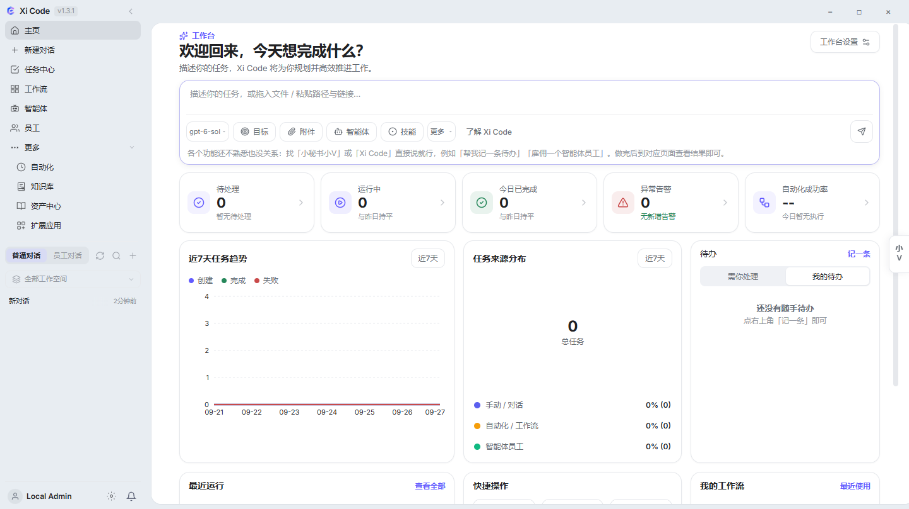
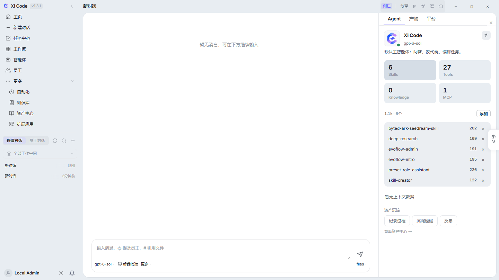
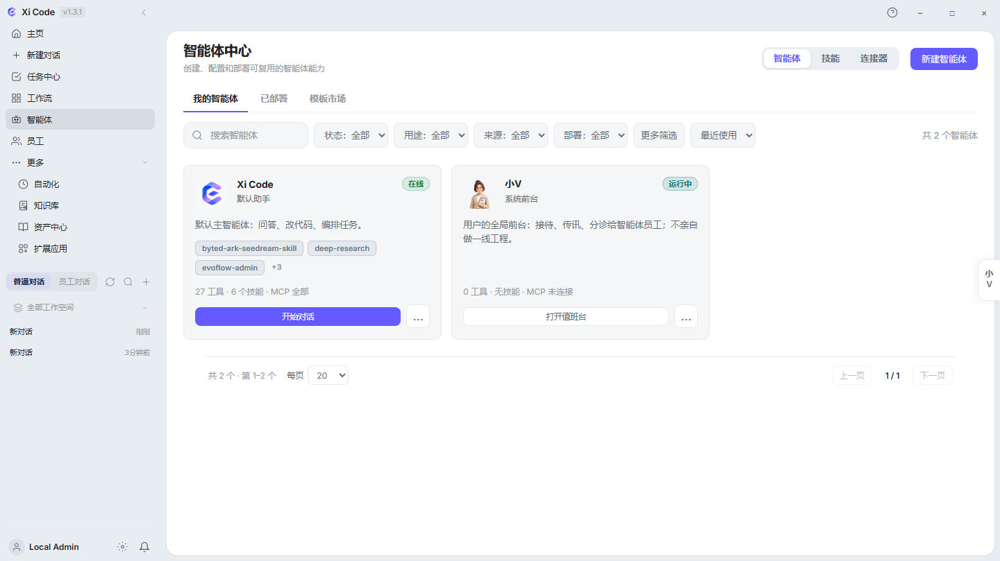

# Xi Code

> 面向个人开发者和小团队的 Windows 本地优先 AI 工作台

[下载最新版](https://github.com/huahuaduck/xi-code-releases/releases/latest) · [查看全部版本](https://github.com/huahuaduck/xi-code-releases/releases) · [提交问题](https://github.com/huahuaduck/xi-code-releases/issues)

Xi Code 把多模型对话、工具调用、任务协作和可追溯的会话历史放在一个桌面应用里。源码仓库保持私有；本仓库只发布 Windows 安装包、校验文件和版本说明。

## 你可以用它做什么

- **写代码**：在工作区上下文中问答、改代码、查故障、整理文档。
- **跑任务**：把多步骤工作交给任务中心、工作流或智能体执行。
- **接模型**：配置多个 OpenAI 兼容接口或本地模型，按任务切换。
- **留记录**：搜索、置顶、分叉、导出和安全删除会话，保留可追溯上下文。
- **接工具**：通过 Gateway 统一管理文件、浏览器、MCP 和其他工具调用。

## 为什么是桌面应用

界面、Gateway 和模型连接分层运行：桌面端负责交互，本地服务负责会话与配置。数据默认留在本机，工具结果以结构化反馈回到会话；删除操作支持预览和二次确认。

## 安装

1. 打开 [最新版 Release](https://github.com/huahuaduck/xi-code-releases/releases/latest)。
2. 下载 `Xi-code_*_x64-setup.exe`，运行安装程序。
3. 可选：同时下载同名 `.sha256` 文件，在 PowerShell 中校验：

   ```powershell
   Get-FileHash .\Xi-code_*_x64-setup.exe -Algorithm SHA256
   ```

   将输出的哈希值与 Release 中的 `.sha256` 文件进行比对。

当前公开安装包为 **Windows x64**。首次启动需要在应用内配置可用的模型连接；本仓库不包含任何 API Key、Cookie 或私有源码。

## 界面预览







## 发布内容

每个版本可能包含：

- Windows x64 NSIS 安装包
- SHA-256 校验文件
- 更新说明与兼容性备注
- 自动更新所需的 `update/latest.json`

## 源码与反馈

源码仓库为私有仓库：[huahuaduck/xi-code](https://github.com/huahuaduck/xi-code)。如果你发现安装、启动或模型连接问题，请附上 Xi Code 版本、Windows 版本和可复现步骤，在 [Issues](https://github.com/huahuaduck/xi-code-releases/issues) 中反馈；不要上传密钥、Cookie 或私人会话内容。
