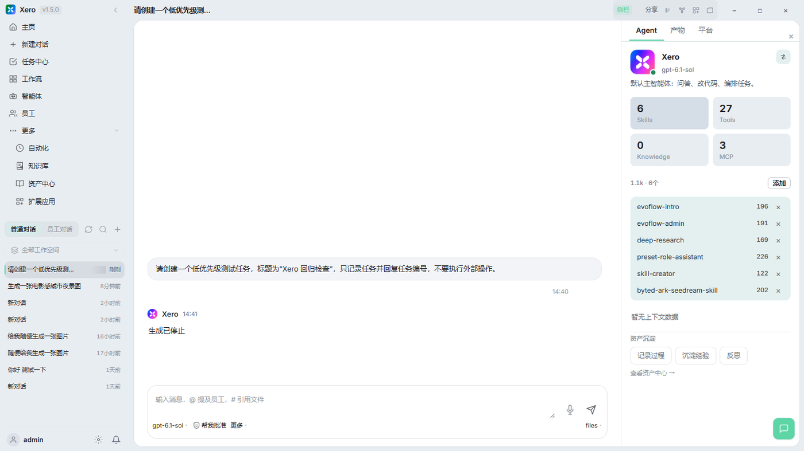
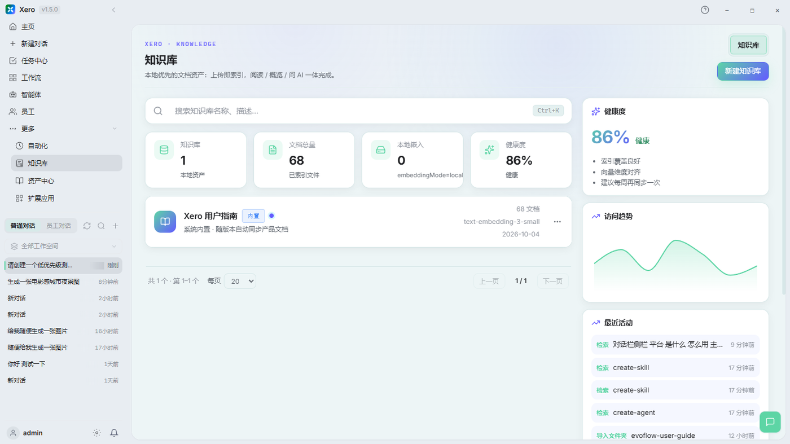
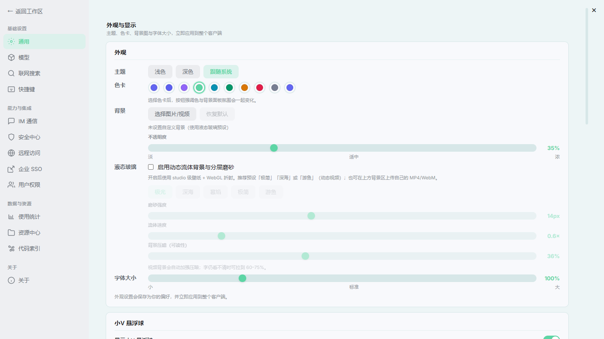

<p align="center">
  
</p>

<h1 align="center">Xero</h1>
<p align="center"><strong>从一个想法，到一份交付。</strong><br>面向个人开发者与小团队的 Windows 本地优先 AI 工作台。</p>

<p align="center">
  <a href="https://github.com/huahuaduck/xero-releases/releases/latest"><strong>下载 Windows 版 ↗</strong></a> &nbsp; · &nbsp;
  <a href="#开始使用">开始使用</a> &nbsp; · &nbsp;
  <a href="https://github.com/huahuaduck/xero-releases/releases">更新记录</a> &nbsp; · &nbsp;
  <a href="https://github.com/huahuaduck/xero-releases/issues">问题反馈</a>
</p>

<p align="center"><sub>v1.5.0 &nbsp; / &nbsp; Windows x64 &nbsp; / &nbsp; 自备模型连接</sub></p>

---

把多模型对话、任务编排、工具调用和自己的资料放进同一个工作空间。用 Xero 写代码、整理文档、拆解任务，再把可重复的步骤沉淀为工作流。



<p align="center"><sub>Xero v1.5.0 实际界面 · 主页与对话工作台</sub></p>

## 软件截图

下面的截图来自 Xero v1.5.0 Windows 桌面版，展示从主页开始，到任务执行、知识检索和界面设置的主要路径。

### 主页与对话工作台

从左侧进入主页、新建对话、任务中心、工作流、智能体和知识库；中间区域用于持续对话，右侧可以查看当前 Agent、Skills、Tools 与 MCP 配置。


### 知识库

集中管理本地文档、索引状态、健康度和最近检索活动，让回答回到自己的资料。



### 外观设置

在设置中调整主题、色卡、背景和字体大小，让工作台适应自己的阅读习惯。



## 一处工作空间，串起完整过程

### 01 / 对话与执行

从问答、代码和文档开始，按任务选择 Ask、Plan、Agent 或 Goal。绑定工作空间后，让模型结合文件上下文协作，并在任务中心查看多步骤工作的状态与输出。

### 02 / 智能体与工具

为不同角色配置模型、技能和工具。通过 Skills、MCP 与连接器接入外部能力，用工具审批和工作空间边界管理执行范围。

### 03 / 知识与复用

把 Markdown、Obsidian 和项目文档纳入知识库。用资产中心整理上下文，用工作流复用步骤，用自动化安排周期性任务。

<details>
<summary><strong>按场景选择入口</strong></summary>

| 想完成的工作 | 从这里开始 |
| --- | --- |
| 提问、总结、比较资料 | 对话 / Ask |
| 先明确步骤与验收标准 | Plan |
| 执行多步骤工作并查看进展 | Agent / Goal / 任务中心 |
| 为研究、开发和审查配置不同角色 | 智能体 |
| 复用固定步骤，只更换输入 | 工作流 / 应用中心 |
| 按时间执行固定指令 | 自动化 |
| 参考自己的笔记、规范和项目资料 | 知识库 |
| 配置长期岗位、值班和汇报 | 智能体员工 |
| 接入外部服务或本地工具 | Skills / MCP / 扩展应用 |

具体入口与可用能力以安装版本为准。

</details>

## 开始使用

**1. 安装桌面端**

前往 [最新 Release](https://github.com/huahuaduck/xero-releases/releases/latest) 下载安装包。当前版本为 **v1.5.0**，文件名为 `Xero_1.5.0_x64-setup.exe`，适用于 **Windows x64**。

该版本未提供自动更新签名，请下载后手动安装。

**2. 连接自己的模型**

打开 **设置 → 模型**，填写服务商、API 地址、API Key 与模型 ID。保存后测试连接，再选择主模型。可以配置 OpenAI 兼容接口、Anthropic、Gemini、国内模型服务或 Ollama 本地模型；实际可用性取决于服务商权限与网络环境。

**3. 完成第一个任务**

先用一个简单问题确认连接。需要处理本地文件时，绑定工作空间，再尝试：

> 阅读这个项目的 README，整理运行步骤和需要我补充的配置，先给出计划。

<details>
<summary><strong>校验安装包 SHA-256</strong></summary>

下载同一 Release 中的 `.sha256` 文件，在安装包所在目录运行：

```powershell
Get-FileHash .\Xero_1.5.0_x64-setup.exe -Algorithm SHA256
```

将输出与校验文件比对。安装包与校验文件应来自同一版本。

</details>

## 在本机组织工作，按需连接模型

桌面端承载交互和工作空间，本地 Gateway 管理会话、配置与工具调用。选择云端模型时，请求会发送给你配置的服务商；选择本地模型时，需要先准备对应的模型服务。

本地优先不代表所有处理都离线。模型、联网搜索和外部工具的数据流向取决于你的连接与权限配置。

<details>
<summary><strong>查看界面设置</strong></summary>

支持主题、色卡、背景和字体大小设置，可按自己的阅读习惯调整工作台。


</details>

## 版本与项目说明

**v1.5.0** 更新品牌图标与界面，修复聊天和主页切换、模型默认思考强度、图片链接、删除会话后的列表同步，以及小 V 头像闪烁。详见 [完整发布说明](https://github.com/huahuaduck/xero-releases/releases/tag/v1.5.0)。

- 当前提供 Windows x64 安装包；macOS 安装包尚未发布。
- 启动速度与 IM 页面卡顿的进一步优化仍在后续计划中。
- 本仓库用于分发安装包、版本说明、校验文件和[自动更新清单](./update/latest.json)。
- Xero 基于 EvoFlow Agent Runtime 与控制平面构建，源码仓库目前为私有。

## 反馈与联系

安装、启动或模型连接遇到问题，请[提交 Issue](https://github.com/huahuaduck/xero-releases/issues)，附上 Xero / Windows 版本、复现步骤和相关错误片段。分享日志前请移除密钥与私人会话内容。

**二次开发与源码合作**，可通过下方联系方式沟通。

<details>
<summary><strong>展开联系方式</strong></summary>
<p>
  
</p>
</details>

---

<p align="center"><strong>让下一项工作，从 Xero 开始。</strong><br><a href="https://github.com/huahuaduck/xero-releases/releases/latest">下载最新版本 ↗</a></p>
