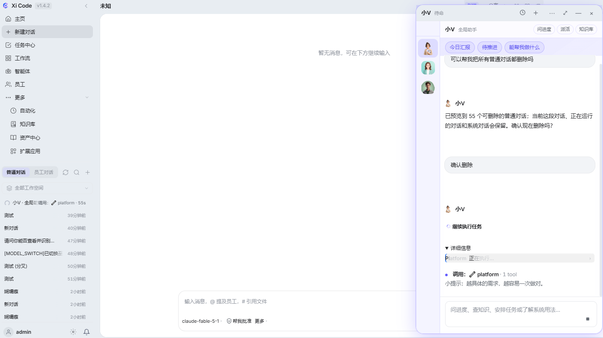
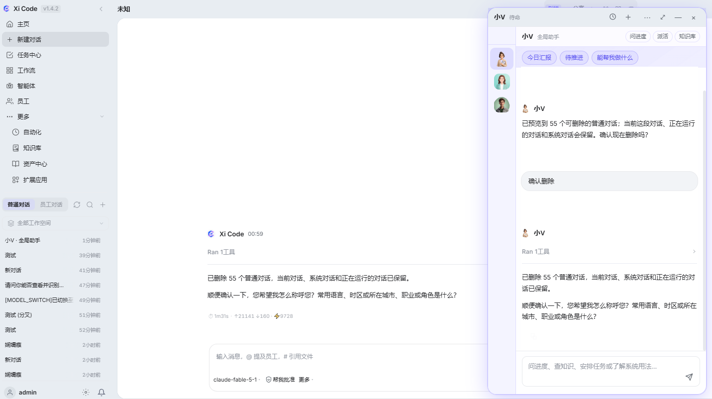
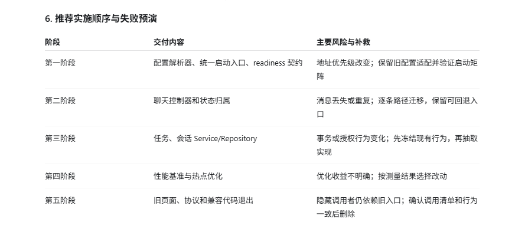

# Xi Code

Xi Code 是面向个人开发者和小团队的本地优先 AI 工作台。它把多模型对话、Gateway 编排、工具调用和可追溯的会话历史放在一个 Windows 桌面应用中。

## 核心功能

- 多模型配置：支持 OpenAI 兼容接口、Reasoning 参数和本地模型连接。
- 本地 Gateway：会话、消息和配置保存在本机，桌面端通过本地服务通信。
- 多轮对话与工具调用：支持代码、文件、浏览器、任务和自动化工作流。
- 会话管理：新建、搜索、置顶、分叉、导出和安全删除。
- 选中文字后右键“添加到对话”，快速把上下文转换为引用。
- 启动缓存与后台刷新，减少重复进入主页时的等待。
- Windows NSIS 安装包，支持离线安装和 SHA-256 校验。

## 使用场景

- 编程问答、代码审查、故障排查和项目文档整理。
- 在本地文件和工作区上下文中进行研发协作。
- 使用不同模型比较回答质量，并保留完整对话记录。
- 个人知识整理、任务拆解和可重复的工具流程。

## 独特功能

Xi Code 将桌面应用、个人 Gateway 和模型连接分层：界面可以快速更新，数据与模型配置仍由本地服务统一管理。会话工具结果会保留结构化反馈，删除操作使用预览与二次确认，减少误操作风险。

## 安装

下载 [Xi-code_1.4.3_x64-setup.exe](./Xi-code_1.4.3_x64-setup.exe)，安装前可使用旁边的 `.sha256` 文件校验完整性。安装包为 Windows x64 版本。

## 截图

源码仓库为私有仓库：[huahuaduck/xi-code](https://github.com/huahuaduck/xi-code)。
