# Xi Code

> 面向个人开发者和小团队的 Windows 本地优先 AI 工作台

<p align="center">
  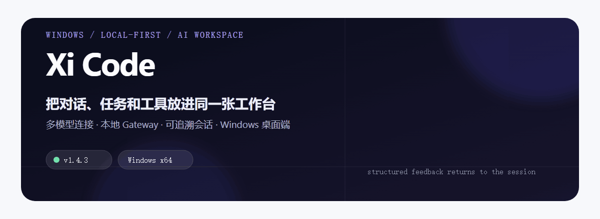
</p>

<p align="center">
  <a href="https://github.com/huahuaduck/xi-code-releases/releases/latest">下载最新版</a> ·
  <a href="https://github.com/huahuaduck/xi-code-releases/releases">查看全部版本</a> ·
  <a href="https://github.com/huahuaduck/xi-code-releases/issues">提交问题</a>
</p>

Xi Code 是以 EvoFlow Agent Runtime 与控制平面为基础的 Windows 桌面发行版：把多模型对话、任务编排、工具调用、知识资产和可追溯会话放进一个工作台。桌面端负责交互，本地 Gateway 负责会话与配置；本仓库只发布可安装的 Windows x64 版本、校验文件和更新清单。

<p align="center">
  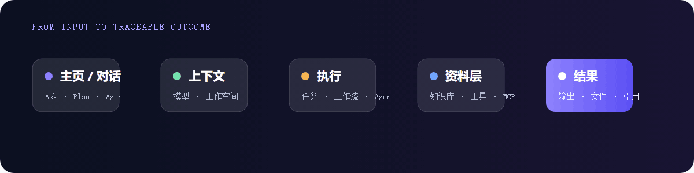
</p>

## 你可以用它做什么

| 工作 | Xi Code 提供的路径 |
| --- | --- |
| 快速提问、写代码、整理文档 | 从主页或新建对话开始，在工作区上下文中连续协作 |
| 先拆解，再执行长任务 | 用 Plan / Goal 明确步骤、风险和停止条件，再交给任务中心跟踪 |
| 把重复工作沉淀下来 | 用工作流 / 应用封装“收集 → 处理 → 输出”等固定流程 |
| 配置不同角色协作 | 让研究员、开发者、审查员等智能体使用不同模型、工具和职责 |
| 让回答参考自己的资料 | 将 Markdown、Obsidian 和项目文档放进知识库，检索关联文档和相关阅读 |
| 定期执行固定检查 | 用自动化按时间或条件触发任务，并在任务中心查看结果 |
| 管理长期可复用上下文 | 用资产中心保存画像、记忆、经验、反思、模板和项目资料 |
| 接入内部工具 | 通过扩展应用把网页应用或本地小工具挂进工作台 |

## 能力全景

下面按 EvoFlow 的产品心智整理 Xi Code 的功能入口；具体菜单名称和可用项会随桌面发行版版本变化。

| 能力层 | 包含什么 | 适合解决的问题 |
| --- | --- | --- |
| **实时对话** | Ask / Agent / Plan / Goal、文件上传、工作空间、右侧 Stage、斜杠快捷指令 | 从一句问题开始，逐步升级到执行、规划或后台长任务 |
| **任务编排** | Plan 计划、Supervisor、子任务 DAG、项目团队、任务中心、暂停 / 恢复 / 重试 / 验收 | 把复杂工作拆成依赖清晰、能追踪和能复盘的交付过程 |
| **固定流程** | 工作流 / 应用中心：画布编排 → 发布 → 填参再跑；自动化：定时或一次性 Prompt | 把重复工作产品化，减少每次重新描述同一套步骤 |
| **智能体组织** | 智能体角色、预设角色、智能体员工、值班频率、工作汇报、关键审批、小 V 临时委派 | 让不同 Agent 分别负责研究、编码、审核或长期值班 |
| **知识与记忆** | 文档知识库、RAG、Obsidian / Markdown Vault、关联文档、相关阅读、资产中心、记忆、经验、反思、思维导图 | 让回答引用自己的资料，并让偏好、经验和过程跨会话沉淀 |
| **技能与工具** | Skills、技能市场、MCP（stdio / SSE / HTTP）、工具白名单、连接器、扩展应用 | 按场景安装和收敛能力，把外部服务接入 Agent |
| **编码协作** | Claude Code 外部编码子代理、写码 / 改码 / 跑测试 / 查日志的流式回传 | 让总控 Agent 委派编码工作，并在桌面端对照验收 |
| **渠道与触达** | 飞书等 IM 渠道、目标与定时结果推送、同一线程心智 | 不打开桌面端也能接收任务结果或继续对话 |
| **安全与治理** | 工作空间边界、沙箱、工具审批、安全护栏、审计 / 运行观测、模型与费用统计 | 控制副作用工具，查看谁调用了什么，并在关键节点人工放行 |

官网文档的功能目录见 [EvoFlow Docs](http://www.evovexai.com/docs/)，当前发行包以本机实际显示的入口和版本说明为准。

## 核心结构

```text
Windows 桌面端
      │ 交互、会话、工作区
      ▼
本地 Gateway
      ├── 模型连接：OpenAI 兼容接口 / 本地模型
      ├── 工具调用：文件 / 浏览器 / MCP / 任务
      └── 结构化结果：回到同一条会话时间线
```

这种分层让界面、模型连接和工具调用可以分别演进，同时把会话与配置留在本机。首次启动后，在应用内配置你自己的模型连接；本仓库不包含 API Key、Cookie 或私有源码。

## 第一次使用建议

1. 打开 **设置 → 模型**，添加服务商、API 地址、API Key 和模型名，并先测试连接。
2. 回到主页，用一句简单问题确认模型能正常回复。
3. 需要读取或修改本地文件时，绑定工作空间，再选择 Ask、Plan、Agent 或 Goal 模式。
4. 需要持续推进的工作放进 **任务中心**；经常重复的步骤做成 **工作流**。
5. 需要引用团队资料时，再把 Markdown、Obsidian 或项目文档接入 **知识库**。

### 按问题选择入口

| 你的问题 | 优先入口 | 不要混用 |
| --- | --- | --- |
| 只想问答、总结或比较 | 实时对话 / Ask | 不必先建 Goal 或自动化 |
| 需要先对齐步骤和验收标准 | Plan | 不要直接让 Agent 无边界执行 |
| 希望后台持续推进到边界 | Goal | 不等同于定时自动化 |
| 每天 / 每周到点执行固定指令 | 自动化 | 不等同于智能体员工值班 |
| 流程已经跑通，只换输入参数 | 应用中心 | 不必每次重新 Plan |
| 需要一个岗位长期值班并写汇报 | 智能体员工 | 不只是一个聊天角色 |
| 让 AI 参考自己的笔记和规范 | 知识库 / RAG / Vault | 不要只把文件拖进一次性会话 |
| 需要外部系统能力 | Skills / MCP / 扩展应用 | 先配置权限和工具白名单 |

常用快捷指令以客户端 `/help` 为准；EvoFlow 文档当前列出的桌面端入口包括 `/claude`、`/lead`、`/goal <目标>`，不同渠道的指令规则可能不同。

### 任务中心：从执行到验收

<p align="center">
  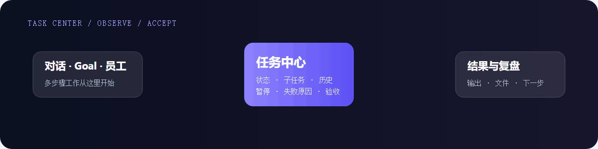
</p>

任务中心汇总来自对话、Goal、智能体员工和工作流的多步骤任务，可查看子任务、状态、历史输出、失败原因，并进行暂停、处理和验收。

### 知识库：让回答回到自己的资料

<p align="center">
  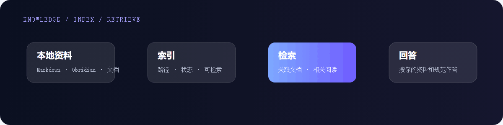
</p>

知识库和聊天历史是两层东西：前者保存可检索的规范、项目说明、接口文档和笔记，回答时再通过关联文档与相关阅读把证据带回当前会话。
### 智能体与工具治理

<p align="center">
  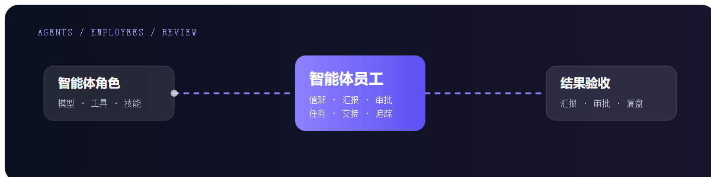
  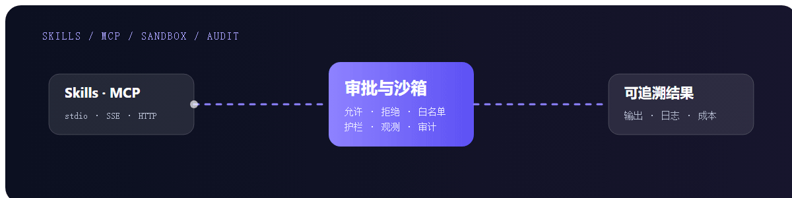
</p>

智能体中心负责角色、技能、连接器和工具组合；智能体员工负责值班、交接和汇报。涉及外部副作用时，再通过工具白名单、审批、沙箱与护栏控制执行边界。

## 安装

当前公开版本为 **1.4.3**，提供 **Windows x64 NSIS 安装包**。

1. 打开 [v1.4.3 Release](https://github.com/huahuaduck/xi-code-releases/releases/tag/v1.4.3)，或进入[最新版 Release](https://github.com/huahuaduck/xi-code-releases/releases/latest)。
2. 下载 `Xi-code_1.4.3_x64-setup.exe`，运行安装程序。
3. 可选：下载同一 Release 中的 `.sha256` 校验文件，在 PowerShell 中执行：

   ```powershell
   Get-FileHash .\Xi-code_1.4.3_x64-setup.exe -Algorithm SHA256
   ```

   将输出的哈希值与校验文件中的值比对。

## 模型对接

在 **设置 → 模型** 中可以添加或管理对话模型、向量模型和语音能力。开发版当前显示的连接入口包括：

- 阿里云百炼、火山引擎、智谱 AI、胜算云、硅基流动
- MiniMax、月之暗面 Kimi、DeepSeek
- OpenAI / 兼容接口、Anthropic 官方、Google Gemini、NVIDIA NIM
- Ollama（本地模型）

每个连接通常需要填写服务商、API 地址（兼容接口可自定义 Base URL）、API Key、模型 ID，并可标注模型能力、上下文长度和套餐/权限。连接保存后，可以执行单模型或批量测试，再选择主模型；对话、Plan、Goal 和智能体会按当前主模型或会话覆盖模型调用。列表里的厂商入口代表可配置类型，是否已接通取决于你自己的 Key、网络和服务商权限。

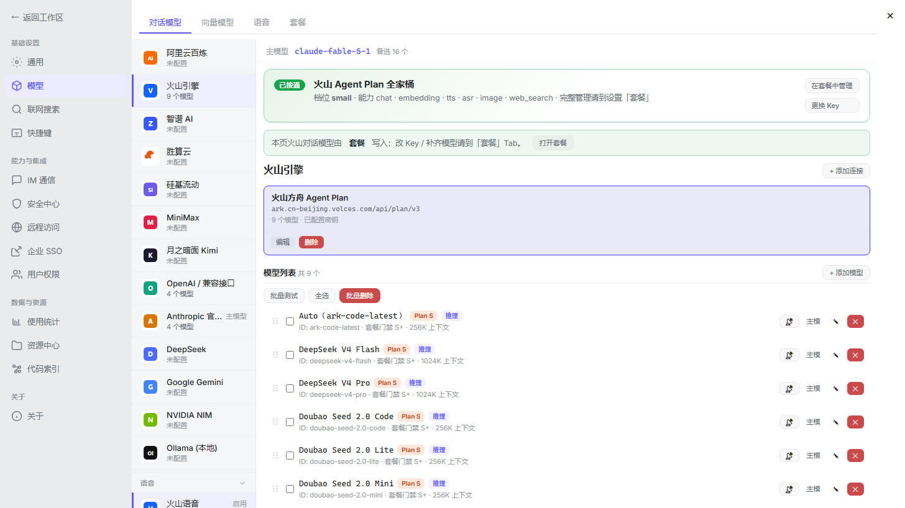
## v1.4.3 界面预览

### 工作台

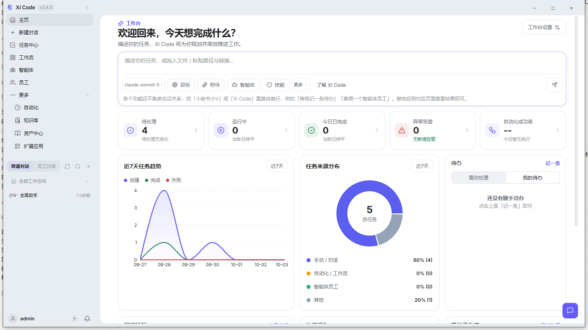

### 任务中心与工作流

<p>
  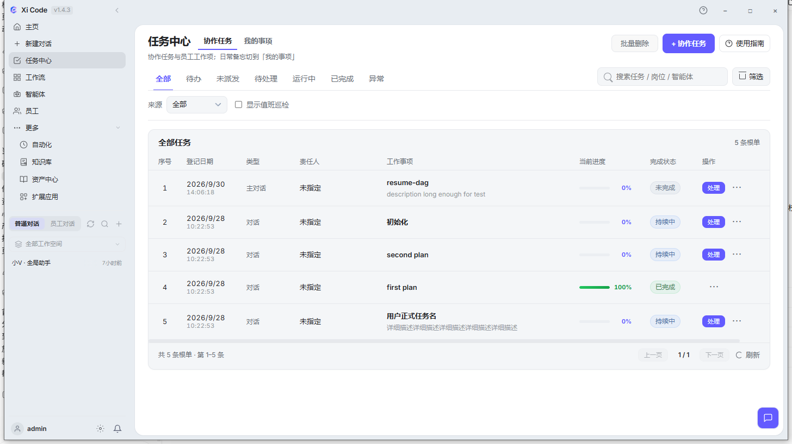
  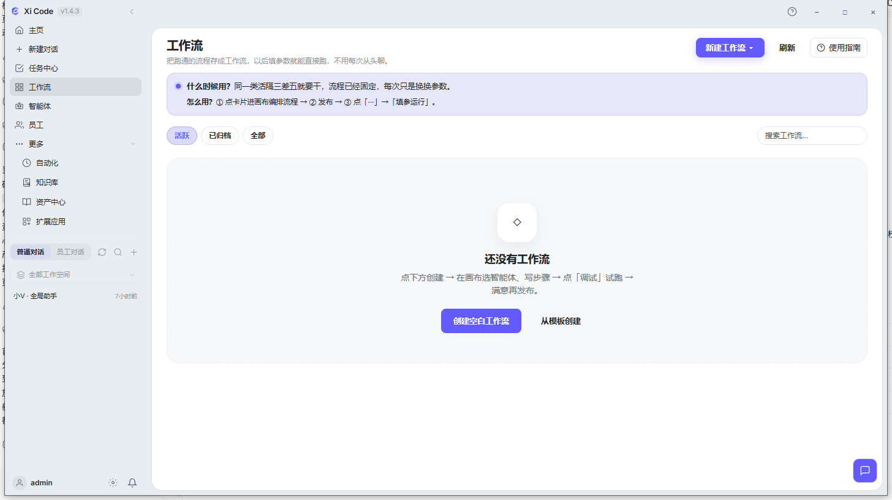
</p>

### 知识库、资产中心与扩展应用

<p>
  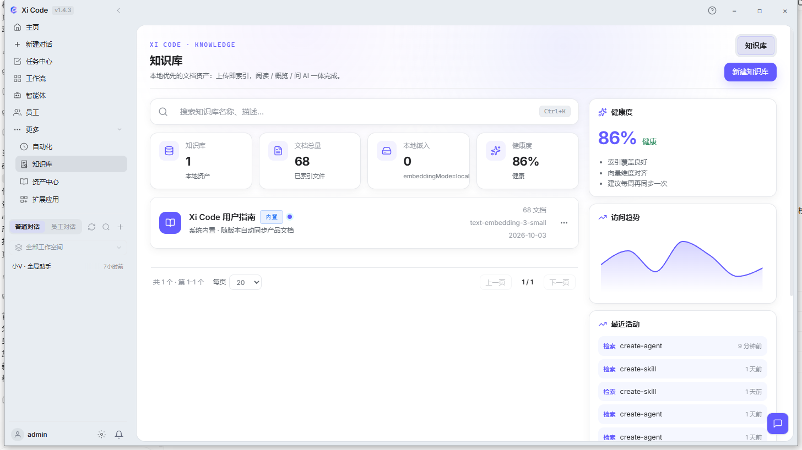
  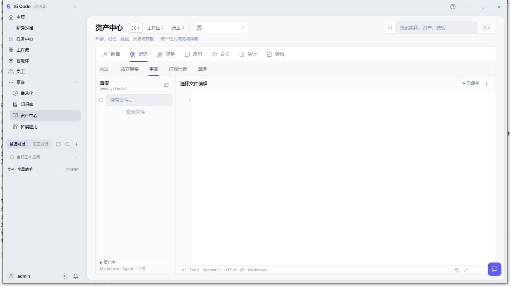
</p>

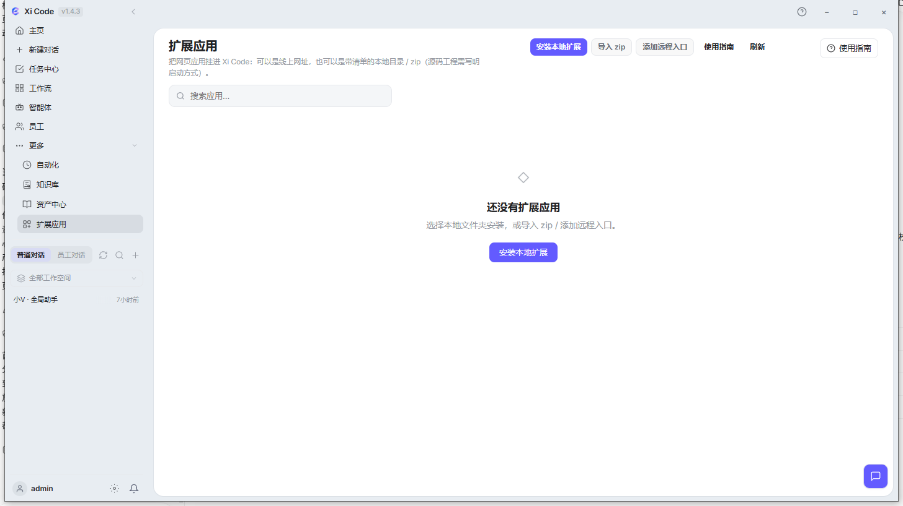
### 开发版实测入口

以下画面来自本地开发版 `v1.4.3`，用于核对当前功能入口与 README 描述：

<p>
  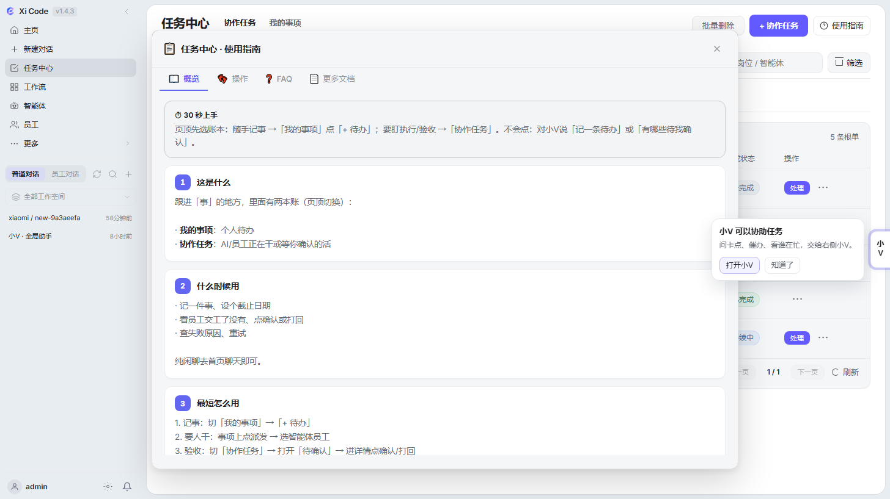
  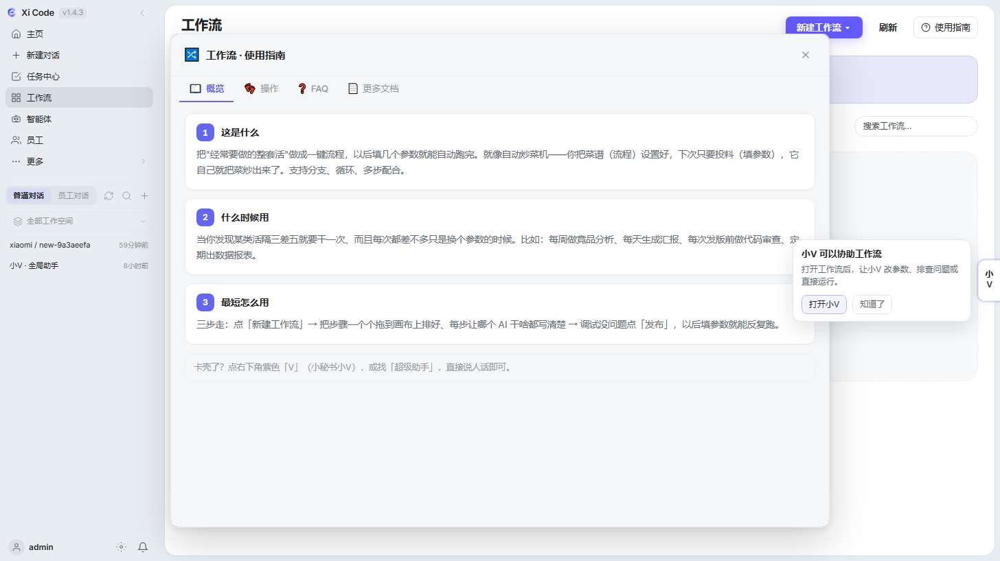
</p>
<p>
  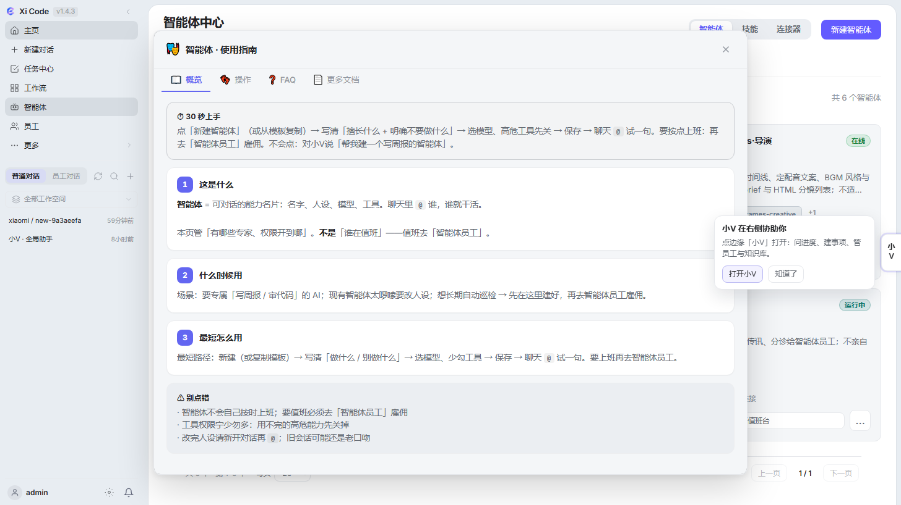
  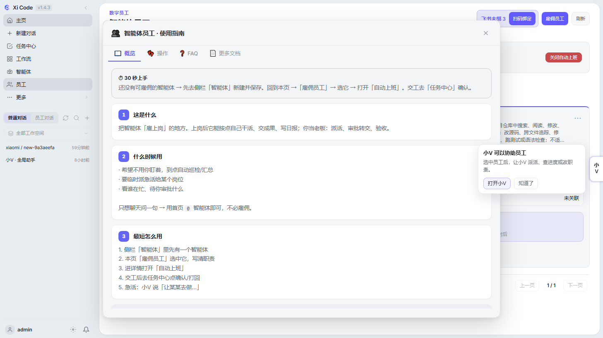
</p>
<p>
  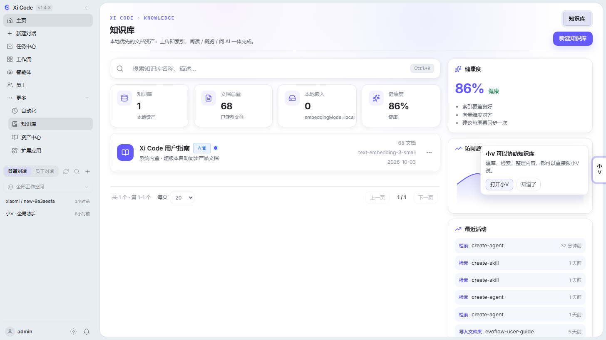
  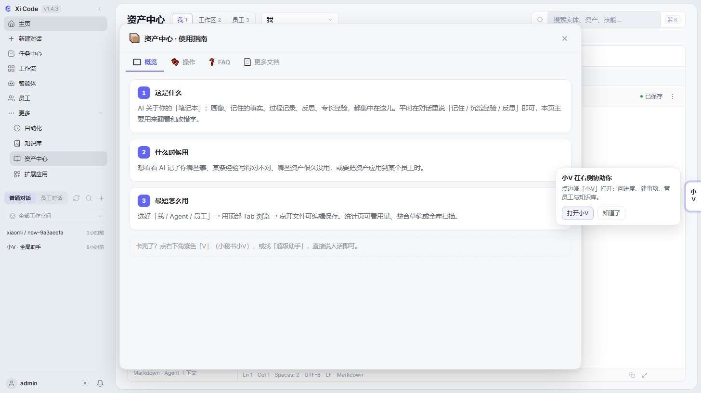
</p>


这些截图均来自本机正在运行的 **Xi Code v1.4.3**。

## 发布内容

每个版本可能包含：

- Windows x64 NSIS 安装包
- SHA-256 校验文件
- 更新说明与兼容性备注
- 自动更新清单 [`update/latest.json`](./update/latest.json)

当前版本的更新摘要：修复图片重复粘贴、Reasoning `none` 参数兼容、模型目录缓存与刷新、会话删除结果对账，并新增选中文字后右键添加到对话。

## 源码与反馈

源码仓库为私有仓库：[huahuaduck/xi-code](https://github.com/huahuaduck/xi-code)。如果你遇到安装、启动或模型连接问题，请在 [Issues](https://github.com/huahuaduck/xi-code-releases/issues) 中附上：

- Xi Code 版本和 Windows 版本
- 可复现步骤与实际现象
- 相关日志中的错误片段（请先移除 API Key、Cookie、私人会话内容）

首图和五张功能动图都保留了可编辑 SVG 源文件：[`assets/readme/`](./assets/readme/)。
